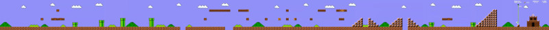

Create Map
==========

Create Map converts a video to a map of the background shown in the video. It works best in videos where the camera movement is orthogonal to the camera direction. It works great, for example, in videos of 2d videogames.

Create Map is a simple example of image stitching / mosaicing.

For example, Create Map takes the frames of a video like this http://www.youtube.com/watch?v=Aw3AwK74wWQ as input, and then it generates the following background map:

([higher res](examples/example-mario.jpg))

Requirements:
-------------

- python
- python imaging library (PIL)
- ffmep or similar program for frames extraction

How to use createmap:
---------------------

If you want to create a map from a video:

1) use ffmpeg to extract the video frames:

	ffmpeg -i video.mpg image%d.jpg

works with mpg, flv, mov, and most video formats. You can remove some of the initial and final frames
before starting map processing. You want your image directory to contain only the frames for a single level or stage, without any effects like fade in or fade out, labels, etc.

2) then change the settings in config.py. An easy way to do the following is:

keep

	colorTolerance=50

Does your image have borders? how big are them? modify:

	imageBorders=(16,0,16,0)

so that the first number tells how big is the left border, the second number tells
how big is the top border, then the right and the bottom border. If the image contains
no borders, use (0,0,0,0) or something like (1,1,1,1) or (2,2,2,2) if you just worry
about a small border in the whole image.

3) how does your video move? if it moves only from left to right (at any times moving to left,
or right, but never top or down), use:

	checkRange=(10,0,10,0)

if it produces a bad map because there is too much movement, try bigger values like:

	checkRange=(20,0,20,0)

a way to know if that's the problem is to check the logged offset values to see if they are
near the limits or not.

If the video moves only from up to down (never left or right), use:

	checkRange=(0,10,0,10)

or:

	checkRange=(0,20,0,20)

If the video moves in all directions, you'll have to set it like this:

	checkRange=(10,10,10,10)

or

	checkRange=(20,20,20,20)

but it's going to be many times slower than if it only moves in one-axis. If it moves very slowly,
perhaps you can try with this setting first:

	checkRange=(5,5,5,5)

4) Now you can run the map creator, just use:

	python createmap.py framedir results.jpg

where framedir is the path to the frames directory.

Extra tips
----------

- Create Map's performance will be proportional to the area of the images it has to process. If you need Create Map to run faster, set all frames to a smaller size. Using Image Magick's "convert" can be useful for this. For example:

	for i in `ls *jpg`; do echo $i; convert $i -resize 320 $i; done 

will resize all images in a directory to a max width of 320 pixels.

- Create Map's peformance will depend on your settings. Specially important: performance will be proportional to the area of the rectangle defined by checkRange. if checkRange is a single line as in (10,0,10,0), Create Map will be really fast. If instead it is a bigger rectangle like (10,10,10,10), it will be much slower. Make checkRange as small as you can.

- Create Map creates a mosaic of frames, putting them in the right positions (whenever it succeeds). One problem that arises often is that the frames of a video can have a border that is not part of the level you want to map. A mosaic of such frames would show a lot of repeated borders inside the image. The way to fix this is either by remove all borders in the images, or to set the imageBorders configuration value.

- Games that use parallax effects for their backgrounds may not let the system compute the right positions for the mosaic, making Create Map build maps that kind of make sense, but that have a lot of noise.

- Games that use effects of moving tiles (eg. for water or lava) may not let the system compute the right positions for the mosaic, making Create Map build maps that are fine almost everywhere, except in the areas where there is a lot of water / lava.

This happens for example in the Earth Worm Jim game, and the reason why this happens is that Create Map needs to estimate the relative position change between frames, and moving water may look to the program as static water with a moving camera.

- Because the process of generating a map can be slow, it is recommended that the value for the different configuration settings is tested in a smaller set of images (say, 100 frames instead of the thousands of frames that can compose the recording of a single stage)

- Most of the times, the resulting map / mosaic won't include any moving objects. However, in some cases you may find that small traces of such moving objects are found in the final map. A way to fix this is to run Create Map on videos where the player kills or picks up all moving objects.

Some examples
-------------

Some further examples about the details above.

- Battletoads, map extracted from [this video](https://www.youtube.com/watch?v=UHgVR0Ykkcc). The map can be seen [here](examples/battletoads.jpg).

This map was built using the following configuration:

	checkRange=(5,5,5,5)
	imageBorders=(16,0,16,0)

(the result is pretty good, even though there are water tiles).

- Contra the Hard Corps, map extracted from [this video](https://www.youtube.com/watch?v=JtWQssQOgoI). The map can be seen [here](examples/contrahardcorps.jpg).

This map was built using the following configuration:

	checkRange=(10,10,0,10)
	imageBorders=(0,0,0,0)

on frames with reduced size:

	for i in `ls *jpg`; do convert $i -resize 160 $i; done 

The result has some good parts, and other parts that are pretty bad. The worst part is at the beginning, possibly because at the beginning the video moves at high speed. It is possible that increasing the checkRange horizontal values would give an improved map, but it would take longer to compute.

- Jazz Jackrabbit, map extracted from [this video](https://www.youtube.com/watch?v=Jk1x5BTSBTw). The map can be seen [here](examples/jazz.jpg).

This map was built using the following configuration:

	checkRange=(10,10,0,10)
	imageBorders=(0,0,0,16)

on frames with reduced size:

	for i in `ls *jpg`; do convert $i -resize 160 $i; done 

- Super Mario Bros 2, map extracted from [this video](https://www.youtube.com/watch?v=9x5AvCTNqV0). The map can be seen [here](examples/supermariobros2.jpg).

This map was built using the following configuration:

	checkRange=(20,0,0,0)
	imageBorders=(48,13,42,15)

The image borders have to be set correctly in this case, or the end result has the overlapping issues described above. Also, the end result shows a lot of sprite pieces.

(This Super Mario Bros 2 example was computed from a different video than the one shown at the top, which explains why the result is a bit different)

- Super Mario Bros 3, map extracted from [this video](https://www.youtube.com/watch?v=bKublR3pZ2s). The map can be seen [here](examples/supermariobros3.jpg).

This map was built using the following configuration:

	checkRange=(10,10,0,10)
	imageBorders=(10,0,0,46)

Again, setting the image borders to the right value was critical to making this case work.

